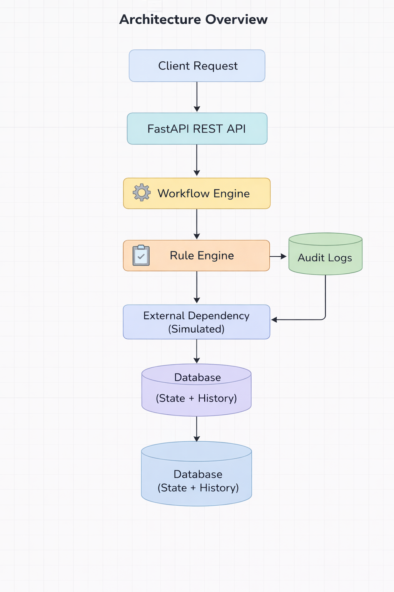

# Configurable Workflow Decision Platform

## Overview

This project implements a **Configurable Workflow Decision Platform** capable of processing business workflows under changing requirements, operational constraints, and rule ambiguity.

The system allows workflows to be defined via configuration and executed through a rule-based decision engine. It maintains workflow state, provides audit logs for explainability, and handles failures and retries.

Example workflows supported by this platform include:

- Application approval workflow
- Claim processing workflow
- Vendor approval workflow
- Employee onboarding workflow
- Document verification workflow

The platform is built to demonstrate **engineering robustness, configurability, auditability, and extensibility**.

---

# Architecture Overview

The system follows a **modular architecture** separating workflow orchestration, rule evaluation, persistence, and API interaction.




## Components

### API Layer
Handles incoming workflow requests and exposes REST endpoints.

### Workflow Engine
Orchestrates workflow execution by loading workflow definitions and executing steps sequentially.

### Rule Engine
Evaluates rule expressions defined in workflow configurations.

### External Dependency Simulation
Simulates external service dependencies such as credit checks.

### State Management
Stores workflow instance state and lifecycle progression.

### Audit Logger
Records rule evaluations and decisions for explainability.

### Database
Stores:

- Workflow instances
- Workflow history
- Input data
- Execution timestamps

---

# Technology Stack

| Component | Technology |
|--------|--------|
Backend API | FastAPI |
Database | SQLite |
ORM | SQLAlchemy |
Testing | Pytest |
Language | Python 3 |


# Setup Instructions

## 1. Clone the repository
<code>git clone 'repository-url'</code><br>
<code>cd workflow-decision-system</code>

## 2. Create virtual environment
<code>python -m venv venv</code>

Activate environment:

<code>venv\Scripts\activate</code>


---

## 3. Install dependencies
<code>pip install fastapi uvicorn sqlalchemy pytest</code>

---

## 4. Run the application
<code>uvicorn app.main:app --reload</code>

Server will start at:
<code>http://127.0.0.1:8000</code>

Interactive API documentation:

<code>http://127.0.0.1:8000/docs</code>

---

# API Endpoints

## Start Workflow
<code>POST /workflow/start</code>

Example request:
```json

{
 "workflow_type": "loan_approval",
 "request_id": "req123",
 "data": {
   "credit_score": 720,
   "income": 50000
 }
}
```
Example response:
```json

{
 "decision": "approved",
 "audit": [
   {
     "workflow_version": "1.0",
     "rule": "credit_score >= 650",
     "result": "PASS"
   }
 ]
}
```
Manual Review Resolution

<code>POST /workflow/manual-review</code>

# Workflow Configuration

Workflows are defined via configuration in:
<code>app/config/workflows.json</code>

Example:
```json
{
  "loan_approval": {
    "version": "1.0",
    "steps": [
      {
        "name": "credit_check",
        "rule": "credit_score >= 650"
      },
      {
        "name": "income_check",
        "rule": "income >= 30000"
      }
    ],
    "success": "approved",
    "fail": "manual_review_pending"
  }
}
```
# Workflow Execution

Execution steps:

1. Client submits workflow request

2. System validates request schema

3. Workflow configuration is loaded

4. External dependency checks executed

5. Rules evaluated sequentially

6. Workflow state stored

7. Audit logs recorded

8. Decision returned

Possible outcomes:

- approved

- rejected

- manual_review_pending

# External Dependency Simulation

External services are simulated using:
<code>external_service.py</code>

# Retry Handling

External dependency failures trigger retries using:
<code>retry_service.py</code>

Retry logic:

- Maximum retries: 3

- Delay between retries: 1 second

# State Management

Workflow state is persisted in the database to ensure reliable tracking of execution progress.

The system stores both the **current workflow state** and the **historical execution trace**.

Two main tables are used:

## workflow_instances

This table stores the current state of each workflow execution.

Fields stored:

- request_id
- workflow_type
- workflow_version
- workflow status
- current stage
- input data
- creation timestamp

Example:

| id | request_id | workflow_type | workflow_version | status | created_at |
|----|------------|---------------|-----------------|--------|------------|
| 1 | req123 | loan_approval | 1.0 | approved | 2025-03-12 |

This table allows the system to:

- track lifecycle state
- support idempotency
- retrieve workflow outcomes quickly


## workflow_history

This table records every stage executed during workflow processing.

Fields stored:

- instance_id
- workflow stage
- rule decision
- execution timestamp

Example:

| instance_id | stage | decision | timestamp |
|-------------|------|----------|-----------|
| 1 | credit_check | True | 2025-03-12 |
| 1 | income_check | True | 2025-03-12 |

This enables:

- full audit trace
- explainable decision logs
- debugging and replay capability


---

# Auditability

Every rule evaluation generates an **audit log entry**.

The audit log contains:

- rule evaluated
- rule result
- workflow version
- input data used for evaluation

Example audit output:

```json
{
  "rule": "credit_score >= 650",
  "result": "PASS",
  "workflow_version": "1.0"
}
```
This enables full decision explainability.
Any workflow decision can be traced back to the exact rules and data that produced it.

# Idempotency

The system ensures idempotent workflow execution using a unique **request_id** for every request.

Before executing a workflow, the system checks whether a request with the same `request_id` has already been processed.

If a duplicate request is detected:

- the workflow is **not executed again**
- the previously stored decision is returned


This mechanism prevents:

- duplicate workflow execution
- inconsistent workflow state
- accidental retries from clients

Idempotency is particularly important for systems where network retries or client failures may cause duplicate requests.

---

# Testing

The project includes automated tests implemented using **pytest**.

Tests can be executed using:
<code>pytest</code>


## Test Cases Covered

### Happy Path

A valid workflow request where all rules pass and the workflow completes successfully.

### Rule Failure

If a rule evaluation fails, the workflow transitions into a **manual_review_pending** state.

### Invalid Input

Invalid or missing input values are handled gracefully without crashing the system.

### Rule Change Scenario

Changing workflow rules in the configuration file results in different workflow decisions without modifying code.

### duplicate request 

Submitting the same workflow request multiple times results in the previously computed decision being returned, ensuring idempotent workflow execution.

---

# Failure Handling

The system is designed to handle multiple failure scenarios safely.

### Invalid Input

Missing or malformed input values are treated as rule failures instead of causing system crashes.

### External Dependency Failure

External services are simulated and may randomly fail.

### Retry Mechanism

A retry mechanism attempts external operations multiple times before returning a failure.

### Duplicate Requests

Duplicate workflow requests are safely handled through idempotency checks.

### Manual Review

If automated rule evaluation cannot determine a final decision, the workflow transitions to the **manual_review_pending** state.

This allows human intervention in complex decision scenarios.

---

# Scaling Considerations

The current implementation runs as a **single-node prototype**, but the architecture allows horizontal scaling.

Possible improvements for large-scale deployments include:

### Stateless API Servers

Multiple API instances can run behind a load balancer.

### Background Workflow Workers

Workflow execution can be moved to background worker processes.

### Message Queue Integration

Workflow tasks can be distributed using messaging systems such as:

- Redis
- RabbitMQ
- Kafka

### Rule Caching

Workflow configurations and rules can be cached in memory to improve performance.

### Database Scaling

For high-volume systems, the database can be scaled using:

- read replicas
- database sharding
- distributed databases

---

# Trade-offs and Design Decisions

Several engineering trade-offs were made in designing the system.

### Configuration-driven Workflows

Workflow logic is defined using configuration files instead of hardcoded logic.

Advantages:

- workflows can change without code modification
- business rules remain easy to update
- improved maintainability

### Lightweight Rule Engine

A simple rule parser was implemented instead of using heavy rule-processing frameworks.

Advantages:

- lower system complexity
- easier debugging
- sufficient flexibility for most workflow scenarios

### SQLite Database

SQLite was selected for simplicity and ease of setup during development.

In production environments, databases such as PostgreSQL would typically be used.

### Retry Strategy

External dependencies are protected with a retry mechanism to improve resilience against transient failures.

### Manual Review State

The workflow engine supports a **manual review stage** where human operators can resolve decisions when automated rules are insufficient.

This allows the system to support **human-in-the-loop workflows**.

---

# Conclusion

This project demonstrates a configurable and resilient workflow decision platform capable of supporting real-world business workflows.

The system provides:

- configurable workflow definitions
- rule-based decision evaluation
- workflow lifecycle tracking
- detailed audit logs for explainability
- idempotent request processing
- failure handling and retry mechanisms

The modular architecture allows the system to be easily extended with additional workflow types, more complex rule logic, and distributed processing capabilities.
